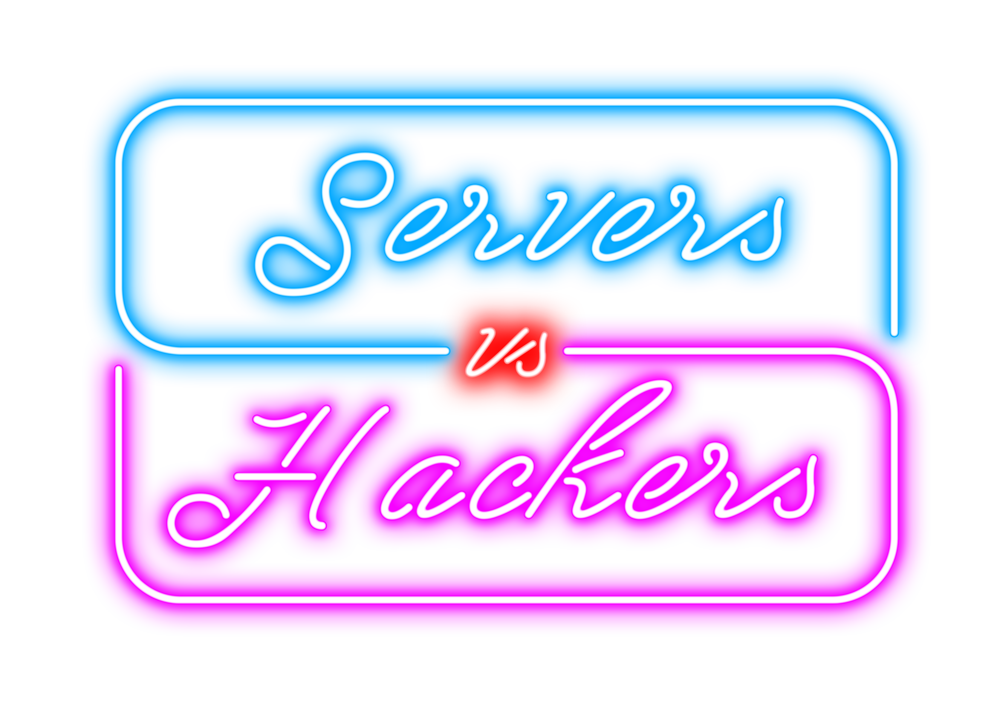

# Ludum Dare 49 Servers VS Hackers

It’s your time to shine!

The servers of Old World and other important clients will be hacked.

You have to enlarge the IT Security of our clients to make us money (you get paid minimum wage on hourly base).

Defend their systems by building Anti-Viruses, Firewalls and by installing VPNs. Maybe the tor browser could help you?

---

Made for the Ludum Dare 49 jam!
---

:video_game: [GameJolt](https://gamejolt.com/games/serversVsHackers/652737)   
:game_die: [Ludum Dare](https://ldjam.com/events/ludum-dare/49/servers-vs-hackers)
